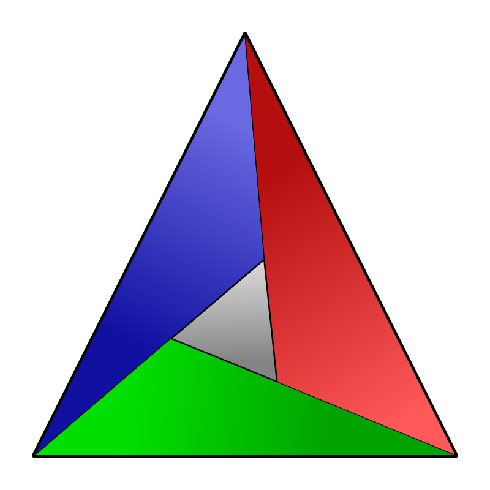
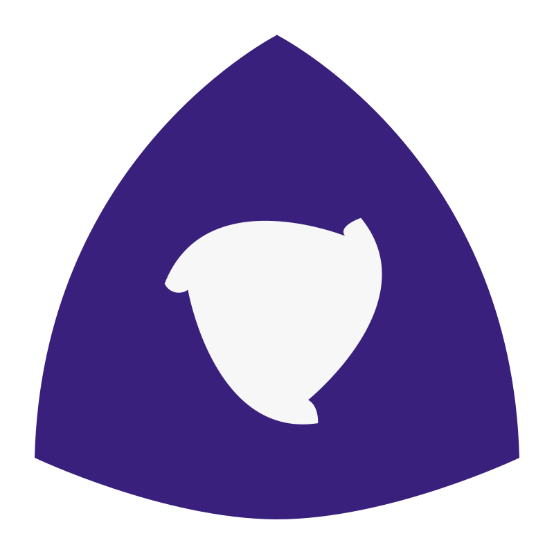
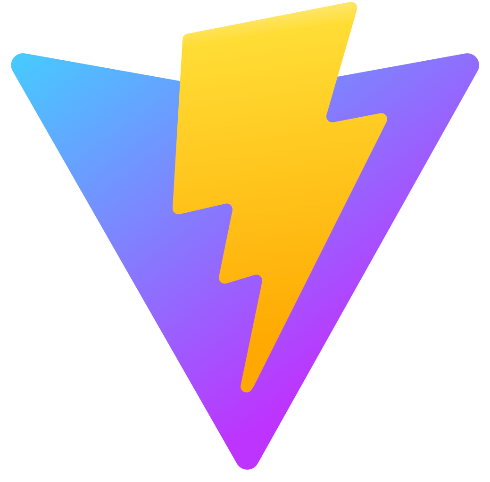
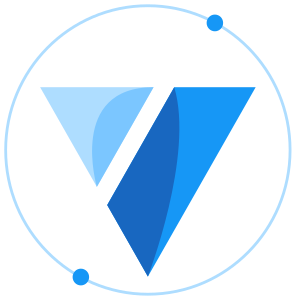

# 💫 About Me:
🔭 I’m mostly use on C/C++, some rust, Go and TS
🌱 I’m currently learning Low level programming
💬 You can ask me about Nuxt and vue
⚡ Fun fact: I like to watch anime and listen to vocaloids like kaito, miku and meiko

## 🌐 Socials:
 

# 💻 Tech Stack:

## System

<table>
  <thead>
    <tr>
      <th>
        
      </th>
      <th>
        
      </th>
      <th>
        
      </th>
      <th>
        
      </th>
      <th>
        
      </th>
      <th>
        
      </th>
      <th>
        
      </th>
    </tr>
  </thead>
</table>

## Backends

<table>
  <thead>
    <tr>
      <th>
        
      </th>
      <th>
        
      </th>
    </tr>
  </thead>
</table>

## Web Techs

<table>
  <thead>
    <tr>
      <th>
        
      </th>
      <th>
        
      </th>
      <th>
        
      </th>
      <th>
        
      </th>
      <th>
        
      </th>
      <th>
        
      </th>
    </tr>
  </thead>
</table>

## Apps Dev languages

<table>
  <thead>
    <tr>
      <th>
        
      </th>
      <th>
        
      </th>
    </tr>
  </thead>
</table>

## Databases

<table>
  <thead>
    <tr>
      <th>
        
      </th>
    </tr>
  </thead>
</table>

## Necessary

<table>
  <thead>
    <tr>
      <th>
        
      </th>
      <th>
        
      </th>
    </tr>
  </thead>
</table>

# 📊 GitHub Stats:
 
 

## 🏆 GitHub Trophies

### ✍️ Random Dev Quote

### 🔝 Top Contributed Repo

---

<!-- Proudly created with GPRM ( https://gprm.itsvg.in ) -->
